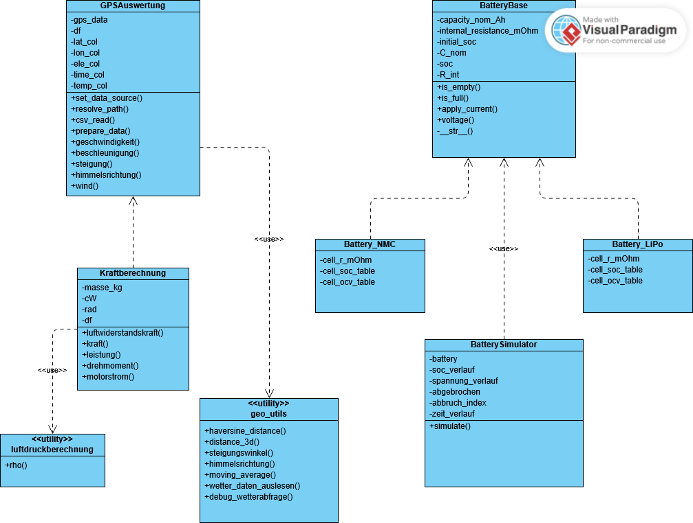
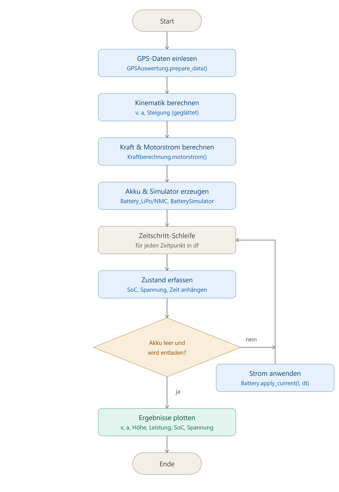

# E-Bike Simulation – Abschlussprojekt

Python-Anwendung zur Auslegung eines E-Bikes auf Basis realer GPS-Tracking-Daten. Basierend auf einem aufgezeichneten Fahrt-Datensatz mit Zeitstempel, Höhe, Position und Temperatur werden Geschwindigkeit, Beschleunigung, Steigung, Kraft, Leistung und Motorstrom berechnet und daraus die benötigte Motorleistung abgeleitet. Außerdem wird der Ladezustand (SoC) und Spannungsverlauf für zwei unterschiedliche Akku-Typen (LiPo und NMC) über die Fahrt simuliert und verglichen.

**Autor:innen:** <Adrian Reiter>, <Tim Thissen> **Modul:** Programmieren – Abschlussprojekt

## Installation

Voraussetzung: **Python 3.10** oder neuer.

1. Repository klonen bzw. entpacken:

   ```bash
   git clone <repo-url>cd Abschlussprojekt_ar-tt
   ```

2. Abhängigkeiten installieren:

   ```bash
   pip install -r requirements.txt
   ```

Damit sind alle für Ausführung und Tests benötigten Pakete installiert.

## Verwendung

Die Simulation und das Aufrufen der Plots werden aus dem Script `Main.py` gesteuert:

```bash
python Main.py
```

Nach Ausführung werden die GPS-Daten aus `final_project_input_data.csv` ausgelesen und daraus schrittweise folgende Punkte berechnet:

1. **Kinematik** (`GPSAuswertung`): Geschwindigkeit, Beschleunigung, Steigung, Höhenprofil – geglättet über einen gleitenden Mittelwert, um GPS-Messrauschen auszugleichen.
2. **Kräfte & Leistung** (`Kraftberechnung`, erbt von `GPSAuswertung`): Luftwiderstand, Antriebskraft (Beschleunigung + Steigung + Luftwiderstand), mechanische Leistung, Drehmoment und daraus der Motorstrom.
3. **Batteriesimulation** (`BatterySimulator`): wendet das Motorstrom-Profil Zeitschritt für Zeitschritt auf ein `Battery_LiPo`- bzw. `Battery_NMC`-Objekt an und zeichnet SoC- und Spannungsverlauf auf.
4. **Parameterstudie** (`parameterstudie`): bekommt verschiedene Parameter für unterschiedliche Ebike-Typen übergeben und berechnet daraus die benötigten Amperestunden und den maximalen Motorstrom, welche anschließend in einem Balkendiagramm dargestellt werden 

Anschließend werden die Plots für Geschwindigkeit, Beschleunigung, Höhenprofil und Leistung angezeigt – `Enter` im Terminal schließt sie. Danach folgen die Plots für SoC und Spannung der beiden Akku-Typen im Vergleich. Abschließend wird die Parameterstudie durchgeführt, wobei anhand einer Tabelle und einem Balkendiagramm die Auswirkungen der verschiedenen Parametern verglichen werden können.

## Projektstruktur

```
.
├── Main.py                          # Orchestriert Auswertung, Simulation und Plots
├── gps_auswertung.py                # GPSAuswertung: CSV einlesen, Kinematik berechnen
├── geo_utils.py                     # Zustandslose geometrische Hilfsfunktionen
├── kraft_Leistungsberechnung.py     # Kraftberechnung(GPSAuswertung): Kraft/Leistung/Motorstrom
├── luftdruckberechnung.py           # Luftdichte in Abhängigkeit von Höhe & Temperatur
├── parameterstudie.py				 # Vergleich von verschiedenen Ebike-Parametern
├── plotting_utils.py                # Plot-Funktionen (Geschwindigkeit, SoC, Höhenprofil, ...)
├── requirements.txt                 # Benötigte Python-Pakete
├── Battery/
│   ├── battery_base.py             # BatteryBase: gemeinsame Akku-Logik
│   ├── battery_LiPo.py             # Battery_LiPo(BatteryBase): LiPo-Kennlinie
│   ├── battery_NMC.py              # Battery_NMC(BatteryBase): NMC-Kennlinie
│   └── battery_simulator.py        # BatterySimulator: SoC-/Spannungsverlauf simulieren
├── tests/
│   ├── test_gps_auswertung.py      # Unit-Tests für GPSAuswertung
│   └── test_kraft_leistungsberechnung.py  # Unit-Tests für Kraftberechnung
├── img/
│   ├── klassendiagramm.png
│   └── aktivitaetsdiagramm.png
└── final_project_input_data.csv     # GPS-Rohdaten (Zeitstempel, lat/lon, ele, temperature)
```

### Klassendiagramm



### Aktivitätsdiagramm



## Umgesetzte Erweiterungen

Über die Grundanforderungen hinaus wurden folgende Punkte umgesetzt:

* **Glättung der Kinematik** (`geo_utils.moving_average`): Geschwindigkeit, Beschleunigung und Steigung werden über ein gleitendes Fenster geglättet, um Rauschen aus unregelmäßigen GPS-Zeitstempeln (z. B. sehr kleine Zeitabstände zwischen aufeinanderfolgenden Punkten) auszugleichen, das sonst zu unrealistischen Beschleunigungs-/Kraftspitzen führt.
* **Himmelsrichtungs-/Windauswertung** (`geo_utils.himmelsrichtung`, `GPSAuswertung.wind`): Berechnung von Azimut und Himmelsrichtung zwischen GPS-Punkten sowie optionaler Abgleich mit historischen Winddaten über die `meteostat`-Bibliothek.
* **Parameterstudie** (`parameterstudie`): Auswirkung von verschiedenen Parametern bei unterschiedlichen Ebike-Typen auf den Motorstrom und die Akkukapazität werden verglichen.
* **Unit-Tests** (`test_gps_auswertung`, `test_kraftberechnung` ): Test von verschiedenen Funktionen der Klassen `gps_auswertung` und `kraft_Leistungsberechnung`. Die Funktionen werden auf ihre Rückgabewerte geprüft, wobei auch verschiedene Fehler geprüft werden.
* <span style="color:red">TODO: Erweiterungen ergänzen!!! </span>

## Quellen

* Barometrische Höhenformel (Luftdichte in Abhängigkeit von Höhe/Temperatur) in `luftdruckberechnung.py`: <https://de.wikipedia.org/wiki/Barometrische_H%C3%B6henformel>
* OCV-Kennlinien und Zellparameter (Innenwiderstand) für LiPo/NMC: <https://mrp123.github.io/MCI-MECH-B-2-PRO1-PRO1-ILV/lectures/15_abschlussprojekt/1_abschlussprojekt.html#/lipo-akku---grundlegend-aufbau>
* Haversine-Formel zur Distanzberechnung zwischen GPS-Koordinaten: Standardformel der Großkreisnavigation: https://de.wikipedia.org/wiki/Haversine-Formel

## Tests

Die Module `gps_auswertung` und `kraft_leistungsberechnung` sind mit Unit-Tests versehen, die verschiedene Funktionen auf ihre korrekte Funktionalität prüfen. 

Die Tests lassen sich wie folgt ausführen:

```bash
python -m pytest
```
